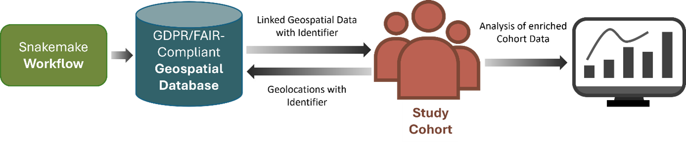

# CLUES: A Comprehensive Workflow for Integrating Geospatial Data in Health Research

## About

The Climate, Urbanicity, Environment and Society (CLUES) framework is a toolkit for generating a harmonised, geospatial environmental database that integrates diverse environmental exposures with health research data at the individual-level. 

The expanding ecosystem of open-access geospatial data offers unprecedented opportunities for synergistic data linkage, yet also presents challenges related to fragmentation, heterogeneity, and technical complexity. Given the growing recognition of the environment as a key determinant of physical and mental health, there is increasing need for scalable tools that enable the systematic integration of environmental data in biomedical research. 

CLUES addresses these needs by enabling selection and automated download of geospatial data from multiple sources, along with the harmonisation of datasets, standardising file formats, spatial and temporal coverage, and map projections to ensure interoperability and consistency across data layers. The CLUES database contains key environmental domains, characterising the built and natural environment, climate and extreme weather, air pollution, and regional socioeconomic conditions. Its framework is designed to be extensible, enabling addition of new environmental variables and ongoing integration of emerging datasets over time. 

CLUES adheres to FAIR (Findable, Accessible, Interoperable, Reusable) data and GDPR (General Data Protection Regulation) principles. 

## Deployment

#### Set up a virtual python environment:

*python -m venv cluesEnv*

#### Activate virtual environment:

Linux:

*source cluesEnv/bin/activate*

Windows:

*cluesEnv\Scripts\activate*

#### Install dependicies:

*pip install -r requirements.txt*

snakemake must be installed seperatly  

*pip install snakemake *

# Config 
There are several config files loacted in the folders *config* and *config_sources*.
### General configs
The folder config contains two files. *bbox.json* is a collection of different bounding boxes for different areas. *config.json* contains the information on what assets to download, where to store the data, where the secrets are located, and for which years, and for which area (here the bboxes listed in *bbox.json* are used) the geospatial features should be downloaded.
### Secrets
To access climate and atmosphere data from Copernicus the necessary credentials need to be place into the configs_assets_folder defined in the *config.json*. See here: https://cds.climate.copernicus.eu/how-to-api
Create the two files *cdsapirc_atmo.sct* and *cdsapirc_climate.sct* and place the ??? in the configs_assets_folder folder.

To access NVDI and EVI data from NASA datapool the necessary credentials are required (https://www.earthdata.nasa.gov/). 
Create the file *nasa.sct* that contains *token: your_nasa_token*. 

### Assets
The geofeatures that will be downloaded are defined in the json files stored in the *config_sources* folder. For each of the data sources used, there is on specific json file. 
To customize check the files to the folder and remove from the variable list contained in each file the variables you do not want to download. 

# Run snakemake
If all is setup run the workflow:

snakemake -s workflows/snakefile --cores 16 -p --rerun-incomplete --latency-wait 60

# Anticipated result

The workflow will download all request files into the folder defined in the config file. While the workflow runs for each of the files downloaded a logfile gets created. If the workflow fails, usually because the corresponding service is not available, one can check the logfile and the workflow needs to be restarted. Other errors like storage is full net to be addressed seperatly.   

# Usage policies

When utilizing data from the CLUES, it is imperative that users adhere to the terms of use associated with the various primary data sources. Each dataset within the CLUES is governed by specific usage policies, and compliance with these terms ensures the ethical and legal use of the data. Users are encouraged to review  and understand the terms of use for each primary data source before downloading and employing the data in their research.
