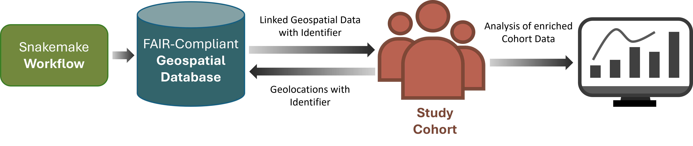

# CLUES: A Comprehensive Workflow for Integrating Geospatial Data in Health Research

## About
CLUES (Climate, Urbanicity, Environment and Society) is a modular workflow that enables researchers to systematically integrate open-access geospatial environmental data with health research datasets at the individual-level. It automates the download, harmonisation, and management of data across climate, built/ natural environment, air pollution, and regional socioeconomic conditions.

**Key Features**  
- Automated data retrieval from multiple open-access geospatial sources  
- Standardised harmonisation of spatial/ temporal coverage, projections, and file types  
- Modular integration with health cohort datasets at the individual level  
- Extensible architecture for adding new environmental variables over time  
- Adherence to FAIR (Findable, Accessible, Interoperable, Reusable) and data protection principles  

## Getting started
- To understand the scientific foundation of CLUES, please read our publication (**link coming soon**).  
- To get an overview of the geospatial data and data sources used in CLUES, see the [Data List](docs/datalist.md). For more infomation, visit the [Geospatial Data Guide](docs/geospatial_data.md).  
- To learn how to use the CLUES framework, follow the [User Guide](docs/UserGuide.md) and explore the [Applied Examples](**link coming soon**).  
- [Scripts](scripts) for integrating the geospatial database to location data and [python notebooks](notebooks) for interacting and visualising the geospatial data are available.  
- For more information on software resources, see [here](docs/softwareResources.md).  

## Citation
When using CLUES in your work, please cite our paper  
(**info coming soon**)

## Maintainers 
The CLUES maintainers are:  

- Marcel Jentsch (lead maintainer)  
- Sven Twardziok  
- Elli Polemiti  

## Usage policies
All datasets used in CLUES are open-access and publicly available, but each comes with its own licensing terms and conditions. We encourage users to review the terms of use for each of them to ensure proper citation and responsible use.  
This includes understanding any limits on redistribution, commercial use, or derivative works.  
You can find an overview of the main data sources and datasets included in the default workflow [here](docs/datalist.md), which can help users identify the relevant licenses to consult as needed.

## License
[MIT License](workflows/LICENSE)  
Copyright (c) 2025 BIH-DMBS 
