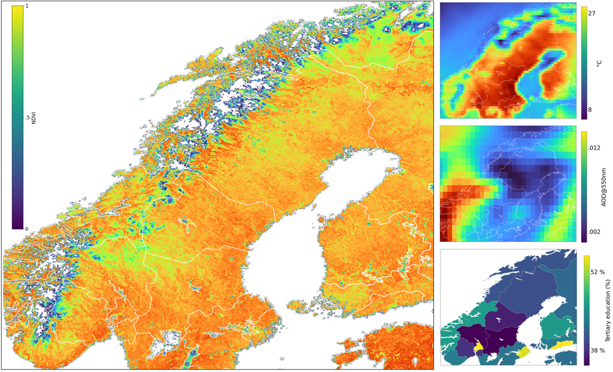

# Example

## Miscellaneous
coming soon :)

## JupyterHub instance

CLUES is designed for scalable, reproducible, and user-friendly deployment. To support dissemination, interactive and collaborative use, we have deployed a database created using CLUES within a [JupyterHub](https://jupyterhub.readthedocs.io/) with pre-configured notebooks for, analysing, summarising and visualising the generated environmental data. 

#### Access

This environment facilitates experiential learning, reduces technical entry barriers for new users, and expedites the integration of CLUES into established analytical workflows.

To request access to the JupyterHub instance, please send an email from your institutional email address to [dmbs@bih-charite.de](mailto:dmbs@bih-charite.de), including your GitHub username. This step is required to verify your academic or research affiliation. Once your request is approved, you will receive a confirmation email. Please note that processing may take several days.
  
#### Usage

Once you have received your confirmation email, you may log in to [jhub@BIH](https://jhub.bihealth.org/)  using your GitHub credentials. Upon logging in, you will be presented with a selection of server environments tailored to different levels of computational needs and use cases. For most users, we recommend starting with the default server configuration, which is optimized for general-purpose analyses and provides a balanced set of resources.

After selecting your preferred server, you will have access to a suite of tools and pre-configured Jupyter notebooks designed to streamline your workflow. As an initial demonstration, you may explore a geospatial database covering the Scandinavian Peninsula. These notebooks illustrate key functionalities of the CLUES framework and serve as practical entry points for further customization and analysis. Alternatively, you may use the full capabilities of the JupyterHub environment to develop your own workflows, perform exploratory data analysis, or integrate CLUES into broader geospatial or environmental modeling pipelines.

#### Test data provided

To test CLUES the jupyter hub provides environmental data for the Scandinavian Peninsula for 2003 to 2024.

