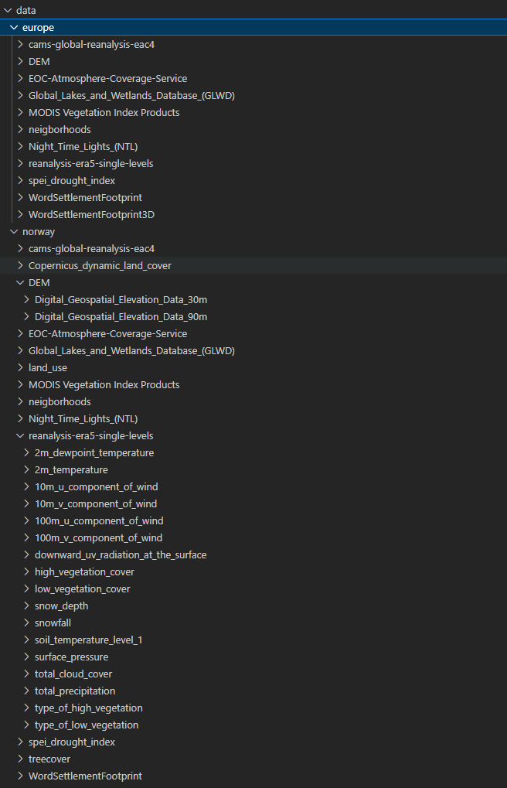

# User Guide

This guide walks you through setting up your environment and running the CLUES data processing workflow using Snakemake - a workflow management system that automates the execution of data analysis pipelines.

## Prerequisites
Before getting started, ensure the following tools are installed:  

- Python 3.8 or higher  
- `pip` (Python package manager)  
- Git  
- [Snakemake](https://snakemake.readthedocs.io/en/stable/)  
- (Optional but recommended) `conda` — for reproducible environments  

---

## Setup Instructions

### Clone the Repository  
Navigate to your preferred working directory and clone the CLUES repository:  
<pre>
git clone https://github.com/BIH-DMBS/CLUES.git
</pre>

### Set up a virtual python environment:  
<pre>
python -m venv cluesEnv
</pre>

**Activate the virtual environment**

Linux/macOS:  
<pre>
source cluesEnv/bin/activate
</pre>

Windows:  
<pre>
cluesEnv\Scripts\activate
</pre>

### Install dependencies:  
Install the required Python packages:  
<pre>
pip install -r requirements.txt
</pre>

---

## Third party accounts
To enable the CLUES framework to access certain geospatial datasets, users must register with specific data providers and generate personal access tokens.  
[!NOTE] 
The location of the credential (.sct) files is defined in the general workflow configuration file **config.json** under the key: `configs_assets_folder`. For more details on configuration management, see the section Configuration Management. 

### Copernicus (ECMWF)
Data from the Copernicus Climate Data Store (CDS) and the Atmosphere Data Store (ADS) requires a free account with the European Centre for Medium-Range Weather Forecasts (ECMWF).

**_Steps_**  
1. Create an ECMWF account at ecmwf.int  
2. Visit:  

    - CDS API instructions at https://cds.climate.copernicus.eu/how-to-api  
    - ADS API instructions at https://ads.atmosphere.copernicus.eu/how-to-api  
    - DEM Copericus create user account: https://www.copernicus.eu/en/user/login

3. Generate personalized API tokens from both platforms


**_Token Storage_**  
Save the tokens in two separate files:  
*cdsapirc_atmo.sct*
<pre>url: https://ads.atmosphere.copernicus.eu/api
key: place your token here</pre>

*cdsapirc_climate.sct*  
<pre>url: https://cds.climate.copernicus.eu/api
key: place your token here</pre>

**_Copernicus credential Storage_**  
*copernicus_credential.sct*
<pre>grant_type : password
username : place your username here
password : place your password here
client_id : cdse-public</pre>

### NASA EarthData
Accessing vegetation indices (e.g., NDVI, EVI) from NASA’s Earthdata platform also requires registration.

**_Steps_**  
1. Register at [earthdata.nasa.gov](https://www.earthdata.nasa.gov/)  
2. Create a personal access token  


**_Token Storage_**  
Create the following file:  
*nasa.sct*  
<pre>token: place your token here</pre>

---

## Configuration Management  
The CLUES framework is customized through a set of configuration files that define the structure and behavior of the workflow. These include:  

- A general workflow configuration file: `workflows/config/config.json`  
- Source-specific configuration files for each data provider: `workflows/config_sources/`  
- A file for predefined bounding boxes: `workflows/config/bbox.json`  

### General workflow configuration file  
The file `workflows\config\config.json` defines the core parameters for how CLUES operates. It allows full control over what the workflow does, where data is stored, and how different components behave.  
Below an example of `config.json`:  

<pre>
{
    "download_folder":"/clues/data",
    "tmp_folder":"/clues/tmp",
    "configs_assets_folder":"/clues/configs_sources_test",
    "config_folder":"/clues/config",
    "secrets_folder":"/clues/secrets",
    "years": ["2015", "2016", "2017", "2018", "2019", "2020", "2021", 
                "2022","2023","2024","2025"],
    "update_years":["2025"],
    "area":"Europe",
    "espon_filename_length":80
}
</pre>

**Key Parameters Explained**  

- download_folder: Path to where all output files will be stored  
- tmp_folder: Folder used for temporary intermediate files  
- configs_assets_folder: Folder that holds the source-specific configuration files  
- secrets_folder: Path where access credentials, e.g., .sct files, are located  
- years: List of years for which data should be downloaded  
- update_years: Years to be refreshed if the workflow is rerun on an existing database. This is especially of interest for data with high temporal resoultion like climate and antmospheric data  
- area: Refers to predefined region from workflows/config/bbox.json (see next section)  
- espon_filename_length: Limits the length of filenames for ESPON downloads to prevent exceeding system file length restrictions.   

Note: The key "espon_filename_length" is an integer value to limit the filename lengths used while downloading the espon data. The filename is generated from the naming and dimension of the different assets (https://database.espon.eu/api/). As single filename cannot exceed 255 characters, therefore, the limit is necessary.  

### Bounding boxes  
CLUES framework comes with a predefined set of bounding boxes found in `workflows\config\bbox.json`. Custom bbox must also placed in this file. For example, the bounding box for Europe is represented as "Europe": [72, -15, 30, 42.5]. Here, 72 is the minimum longitude, -15 is the minimum latitude, 30 is the maximum longitude, and 42.5 is the maximum latitude.  

example: 'bbox.json'
<pre>
{
    "Europe":[72, -15, 30, 42.5],
    "Germany":[55.0581, 5.8663, 47.2701, 15.0419],
    "UK":[60.8608, -8.6493, 49.9096, 1.7689],
    "Brandenburg":[53.5587, 11.2682, 51.3618, 14.7636],
    "Berlin":[52.7136,12.9673,52.2839,13.816],
    "Norway":[71.1850, 4.9921, 57.9586, 31.0781],
}
</pre>

### Source-specific configuration files
Each of the primary data sources used by CLUES is utilized and customized on the basis of a distinct configuration file. The base as curated by CLUES is located in the folder `workflows\config_sources`. The location of the used *configs_assets_folder* can be customized in the *config.json*. These files contain metadata on the primary sources. Each of the source-specific configuration file located in the folder `workflows\config_sources` contains the key `"variables"` that is linked to a list of assets to be downloaded. To change what assets to download from the different sources simply remove items from the list.  

Example of the source-specific configuration file `cams-global-reanalysis-eac4.json`  
<pre>
{
    "type":"atmosphere",
    "source":"cams-global-reanalysis-eac4",
    "file":"cams-global-reanalysis-eac4.json",
    "link": "https://ads.atmosphere.copernicus.eu/cdsapp#!/dataset/
                cams-global-reanalysis-eac4?tab=form",
    "citation":"Inness et al. (2019), 
                http://www.atmos-chem-phys.net/19/3515/2019/",
    "start_year": "2003",
    "end_year": "2025",
    "delta_t_in_h":"3",
    "format": "netcdf",
    "variables":[
        {
            "name":"black_carbon_aerosol_optical_depth_550nm"
        },
        {
            "name":"dust_aerosol_optical_depth_550nm"
        },
        {
            "name":"organic_matter_aerosol_optical_depth_550nm"
        },
        {
            "name":"sea_salt_aerosol_optical_depth_550nm"
        },
        ...
    ]
}
</pre>


**Neighbourhood-level processing**  
CLUES supports neighbourhood-based operations to enhance spatial analysis by incorporating local spatial context. These operations apply filters, such as mean, standard deviation, or terrain-based Zevenbergen–Thorne metrics, within neighbourhood zones, which are circular areas around each pixel defined by a specified radius. The Zevenbergen-Thorne algorithm is utilized on digital elevation models (DEMs) to derive topographic features such as slope (terrain steepness) and aspect (direction the slope faces).  

Neighbourhood zones represent the spatial extent used to calculate local statistics around a point. Smaller zones focus on immediate surroundings and fine-scale variation, while larger zones capture broader spatial trends and context.  

Whether and how this processing is applied is defined in the source-specific configuration files, which specify the filter type and the radius of the neighbourhood zone. Default configurations are provided, but users can easily adapt them to meet specific analytical needs.  

Example of the source-specific configuration file `copenicus_dem.json`  
```bash
{
    "type":"DEM",
    "format": "geotTiff",
    "variables":[
        {   "name":"Digital_Geospatial_Elevation_Data_30m",
            "url":"https://prism-dem-open.copernicus.eu ...",
            "resolution":"30",
            "neighborhood":{
                "mean":[500,1000],
                "std":[500,1000],
                "zevenbergen_thorne: "yes"}
  ]
}
```

---

## Run the workflow
Once everything is set up, third-party accounts are configured, and the configuration files are customized, you can run the CLUES workflow using Snakemake:  

<pre>
snakemake -s workflows/snakefile --cores 16 -p --rerun-incomplete --latency-wait 60
</pre>

Command Options Explained:  

- -s workflows/snakefile specifies the Snakefile path  
- --cores 16 uses 16 cores for parallel execution  
- -p prints out shell commands being executed  
- --rerun-incomplete reruns any jobs that were not completed  
- --latency-wait 60 waits up to 60 seconds for output files (useful on shared filesystems)  

## Adding a New Dataset to CLUES: WorldPop Example

This tutorial provides a short guide for adding a new dataset to CLUES, using the WorldPop population distribution raster (i.e., a gridded map, where each pixel stores a population estimate) as an example. It demonstrates where external data can be integrated within the CLUES architecture, and what level of coding effort is required.
The guide outlines the relevant components of the CLUES codebase, provides minimal working code snippets, and links to the corresponding sections of the technical documentation. By the end of the tutorial, users should be able to understand the workflow for extending CLUES and integrate new datasets. 
The workflow consists of five main steps:

1. Accessing WorldPop data
2. Inspect available WorldPop products
3. Create a source-specific configuration file
4. Register the dataset in the CLUES Snakemake workflow
5. Implement a small download script

### Step 1. Accessing WorldPop Data

WorldPop provides high-resolution population and demographic data in raster format, covering multiple years and regions globally (Open Spatial Demographic Data and Research - WorldPop). The dataset is widely used in public health, demography, and epidemiology.
For programmatic access, WorldPop offers a RESTful API (https://www.worldpop.org/sdi/introapi/). Python users can interact with this API through the WorldPopPy library, which allows you to:

- retrieve population rasters for countries, regions, or custom bounding boxes (AOIs)
- specify product types (e.g., PPP: people per pixel, wpgpas: age/sex-stratified layers)
- download data for single years or a range of years
- automatically handle missing data masking and caching
- save rasters directly as GeoTIFF files for downstream processing

### Step 2. Accessing WorldPop Data

Before adding a dataset to CLUES, it is helpful to explore which WorldPop products exist and for which years they are available. To get an overview on the available datasets, use the WorldPopPy library as below: 

```bash
#pip install WorldPopPy  # first install library
from worldpoppy import wp_manifest
import pandas as pd
manifest = wp_manifest()
# Show distinct product names
products = manifest["product_name"].unique()

table = []
for p in products:
    sub = manifest[manifest["product_name"] == p]
    years = sorted(sub["year"].dropna().unique())
    table.append({"product_name": p, "years": years})

df = pd.DataFrame(table)
print(df)

```

In this tutorial, we will integrate the PPP (people per pixel) product, a raster where each cell represents the estimated number of people living in that grid cell. This dataset is available for the years 2000–2020. 

### Step 3. Create a source-specific configuration file

Next, create a configuration file that tells CLUES how to download the WorldPop dataset.
This file specifies:
- the data source type
- the time range
- file format
- and the specific variables or products to retrieve

Create a new file named:
<pre>
config_sources/worldPop.json
</pre>

```bash
{
    "type": "WordPop",
    "format": "geoTIFF",
    "variables":[
        {   
            "name":"people_per_pixel",
            "product_name":"ppp",
            "start_year": "2000",
            "end_year": "2020",
        }
    ]
}
```

The “variables” block can include multiple items when a source provides several distinct datasets.
All source-specific configuration files must be stored in the folder defined by [configs_sources](https://github.com/BIH-DMBS/CLUES/blob/main/configs_sources/) in the general CLUES configuration. In this example the file is called: [worldPop.json](https://github.com/BIH-DMBS/CLUES/blob/main/configs_sources/worldPop.json).


### Step 4. Register the dataset in the CLUES Snakemake workflow
After creating the configuration file, you must tell CLUES’ Snakemake workflow how to use it. This involves three small changes in the Snakefile [Snakefile](https://github.com/BIH-DMBS/CLUES/blob/main/workflows/snakefile):

i. **Add the configuration file to the list of sources.** Locate the dictionary that lists all data sources and add an entry for WorldPop: 
```bash
files = {
       …,
       'era5_land':os.path.join(CONFIGS_ASSETS_FOLDER, 'reanalysis-era5-land.json'),
       'worldpop':os.path.join(CONFIGS_ASSETS_FOLDER, 'worldpop.json'),
}
```

This makes Snakemake aware of the new source-specific *config.file*.


ii. **Define the expected output files** Extend the section that builds the list of files CLUES should download. For WorldPop, add: 

```bash
if key == 'worldpop':
    for v in items:
        year_list = [str(year) for year in range(int(v["start_year"]), int(v["end_year"]) + 1)]
        year_list = list(set(year_list) & set(years))
        input = input + expand(os.path.join(download_folder, parameters['worldpop']['type'], v['name'], '{year}.nc'), 
            year=year_list)
```

This section collects the file paths for WorldPop data. For each dataset, it selects the years within the specified range that are available, then generates the corresponding file paths for those years. These paths are added to the list of input files to be processed.

This instructs Snakemake to include all WorldPop files for the requested years in the workflow. For example: (['/downloadfolder/WordPop/people_per_pixel/2017.nc',…,'/downloadfolder/WordPop/people_per_pixel\\2018.nc']).

iii. **Add a Snakemake rule for downloading WorldPop.** Create a rule that specifies how WorldPop data should be downloaded:

```bash
rule worldpop: #worldpop
    output:
        os.path.join(download_folder, parameters['worldpop']['type'], '{variable}', '{year}.nc')
    params:
        var="{variable}",
        file=files['worldpop'],
        year="{year}"
    shell:
        "python workflows/worldpop.py {params.file} {params.var} {params.year} > log_{params.var}_{params.year}.log 2>&1"
```

This rule defines how to generate WorldPop data files. For each variable and year, it specifies where the output file will be saved and which input file to use. It then runs a Python script to create the file, saving a log of the process for reference.

This rule ensures that each required file triggers a call to the download script (defined in Step 5), if the file is not already present.
Tip: You can check the actual snakefile of CLUES to see where the code snippets are located.

### Step 5. Implement a small download script

The final step is to add a small script that performs the download of the WorldPop data. In CLUES, each external data source has a corresponding script inside the workflows directory that calls the underlying download function.

Create a new file:

[workflows/worldpop.py](https://github.com/BIH-DMBS/CLUES/blob/main/workflows/worldpop.py)


and include the following code:

```bash
import os
import sys

# Append the target folder to sys.path
sys.path.append(os.path.join(os.getcwd(), 'utils'))
import worldPopDownload

if __name__ == "__main__":
    json_file = sys.argv[1]
    vOI = sys.argv[2]
    year = sys.argv[3]
    worldPopDownload.getWorldPop(json_file, year, vOI)
```

This script serves as a simple wrapper:
- Snakemake calls it for each required year and variable
- It passes those arguments to the underlying downloader

The actual download logic (API queries, file handling, error management, etc.) is placed in:
[utils/worldPopDownload.py](https://github.com/BIH-DMBS/CLUES/blob/main/utils/worldPopDownload.py)

## CLUES Docker Usage

This repository provides a Dockerized environment for running **CLUES**.  
Using Docker ensures consistent, reproducible, and isolated execution environment without requiring manual installation of Python packages or system dependencies.

---

### Build the Docker Image

Run the following command to build the Docker image locally:

```bash
docker build -t clues .
```

**Configs:** Local config/, configs_sources/, and secrets/ folders are copied into the container.

The config/ and configs_sources/ folders contain default files that run as a short demo.

The secrets/ folder must contain the credential files for the Copernicus CDS API, Copernicus Atmosphere Data Store, and NASA Earthdata login. Template files are included by default but must be updated with personal access tokens. For instructions, see section Third party accounts in the [User Guide](https://bih-dmbs.github.io/CLUES/UserGuide/).


### Running CLUES with Docker

To start CLUES container interactively:

```bash
docker run -it --rm -v ${PWD}/clues_data:/app/CLUES/clues_data clues 
```
This command:
- launches an interactive shell inside the container
- mounts the local clues_data/ folder into the container
- ensures all output from CLUES is written to the local machine.

Inside the container, run the CLUES workflow with:

```bash
snakemake -s workflows/snakefile --cores 16 -p --scheduler greedy --rerun-incomplete --latency-wait 30
```

The folder clues_data/, as defined in your config file, will store all downloaded, processed, and linked data. Because it is mounted, all results appear automatically on your local machine.


## Climate Change Indices

CLUES also provides a script to compute a big chung of the climate change indices suggested by the joint CCl/CLIVAR/JCOMM Expert Team (ET) on Climate Change Detection and Indices (ETCCDI). The team has a mandate to address the need for the objective measurement and characterization of climate variability and change by providing international coordination and helping organizing collaboration on climate change detection and indices relevant to climate change detection, and by encouraging the comparison of modeled data and observations. A list with all suggested indices can be found [here](https://etccdi.pacificclimate.org/list_27_indices.shtml).

To calculate the indices using downloaded temperature data use the script `scripts/climateChangeIndices.py`. The paths and settings that must be changed to run the script on your own infrastructure can be found at the bottom of the script.

The formulas are not restricted to temperture, you can also compute these indices for other variables (e.g., precipitation).

---

## Anticipated results  
The workflow automatically downloads all required geospatial data files into the directory specified in the general configuration file `config/config.json`. For each file retrieved, a corresponding log file is generated during execution, providing detailed information about the download process. These log files are essential for monitoring progress and diagnosing potential issues.  

In cases where the workflow fails — most commonly due to temporary unavailability of external data services — users should consult the relevant log files to identify the source of the problem. Once resolved, the workflow can be safely restarted, and it will resume from where it left off.  

Note that certain issues, such as insufficient storage space or network connectivity problems, must be resolved manually. These fall outside the scope of automated recovery and require user intervention before the workflow can continue successfully.  

Below is an example of the folder structure of downloaded geospatial data for Europe and Norway  



---

## Data enrichment
After running the workflow, the required datasets will be downloaded and stored according to the general configuration specified in `config/config.json`. You can then enrich your data by linking environmental exposures to participant locations.  

### Enrichment for Point Locations
In the simplest case, your data may consist of a CSV file with geocoordinates (latitude, longitude) and a participant ID, as shown below:  
<pre>
latitude,longitude,subjectid
51.876259173091015,14.24452287575035,7858
52.09913944097461,13.654840491247233,3406
53.424305699033326,13.453464611332228,8017
</pre>

To link environmental data to these locations, use the script `/scripts/link_locations.py`. This script processes all NetCDF and GeoTIFF files in the input folder and extracts values at the specified coordinates.  

<pre>
  python link_locations.py locations.csv input_folder output_folder
</pre>

The results of this enrichment process are saved in the output folder. The output includes:  

- JSON files with extracted values from NetCDF features.  
- CSV files with extracted values from GeoTIFF features.  

### Enrichment for Geographic Areas
In addition to point-based enrichment, CLUES supports linking environmental data to geographic areas, such as predefined administrative boundaries (e.g., postal codes or districts).
This allows for aggregation of environmental features across regions rather than individual coordinates, enabling analysis when precise locations are unavailable or when regional exposures are more relevant.

> Scripts for area-based enrichment will be available soon.  

---

## Next Steps: Try It Out  
To help you get started, we provide simple [applied examples](https://github.com/BIH-DMBS/CLUES/blob/main/docs/Examples.md). In addition, [scripts](https://github.com/BIH-DMBS/CLUES/tree/main/scripts) are available for enriching a dummy location dataset, and [python notebooks](https://github.com/BIH-DMBS/CLUES/tree/main/notebooks) demonstrate how to interact with and visualize geospatial outputs using a test dataset. These resources offer hands-on guidance, showcasing how different data types and formats can be processed and analyzed within the CLUES environment.
