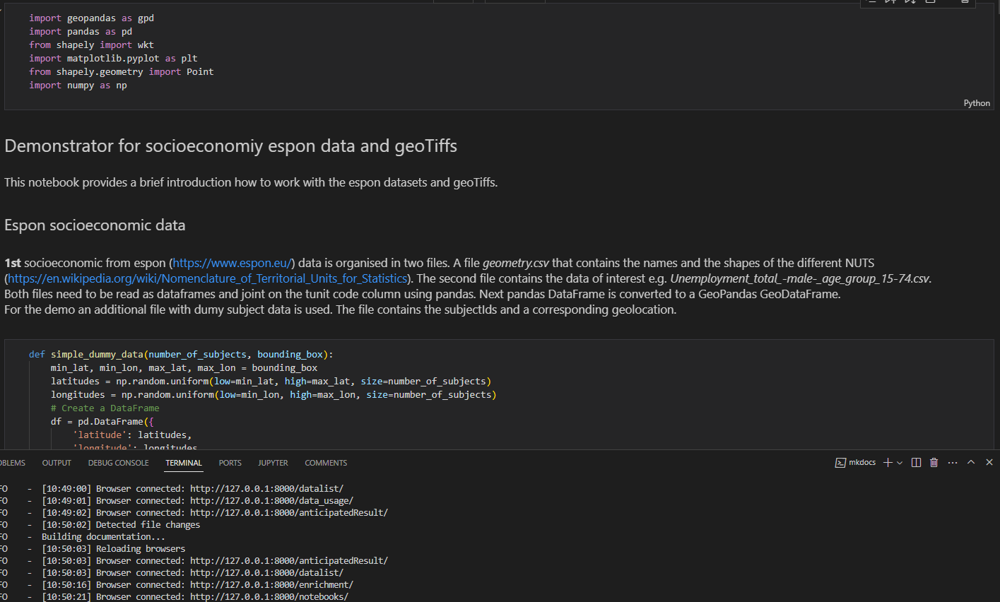

# Notebooks

As part of the CLUES framework, a curated set of Jupyter notebooks is provided to demonstrate the integration, visualization, and application of geospatial data in relation to subject locations. These notebooks serve as practical examples, showcasing how diverse data types and formats can be processed and analyzed within the CLUES environment.

In addition to geospatial demonstrations, supplementary notebooks are available that cover the full spectrum of data sources included in CLUES. Together, these resources offer comprehensive, hands-on guidance for users, facilitating a deeper understanding of the data and supporting reproducible workflows across a variety of research contexts.

